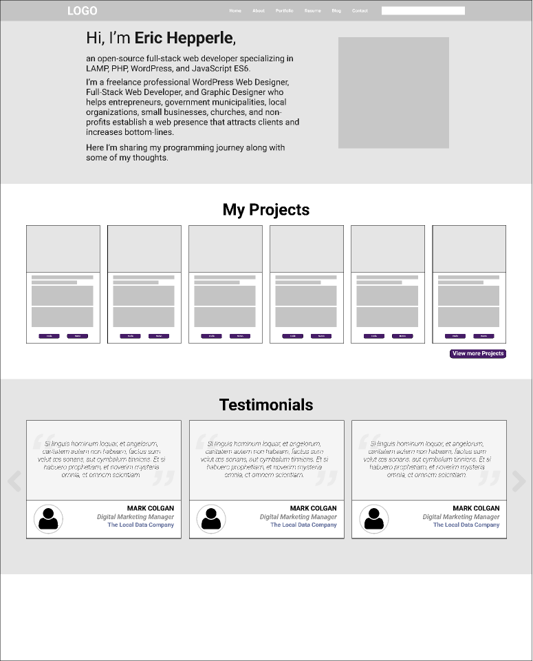
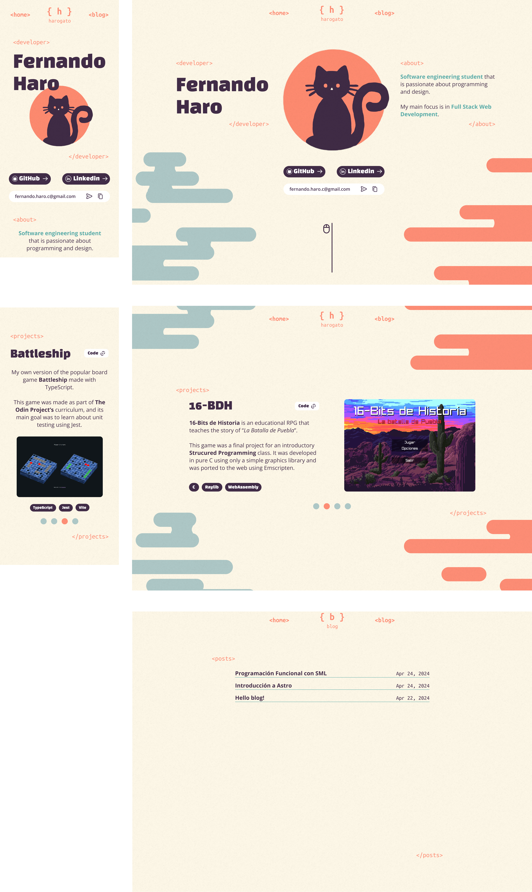

I want to start this post off by saying that I'm not a designer (which should be pretty obvious by looking at this site). I'm primarily an engineering type, which means I'm typically more interested in getting things to work than making them look pretty. That being said, I do think that having a pretty and functional portfolio/blog is important, so I gave it my best shot with this site, and in this post I'll share my personal experience and try to convince you that you could (and probably should) do the same.

## Why Build a Portfolio?

For me, the answer was really simple: I wanted to have a place to showcase my work (y'know, for getting hired) and importantly, a place to write my thoughts down in a more public way, rather than just having them on my journal or some random Notion page.

For other junior/entry-level developers, a portfolio can be a great way to show off your skills and experience to potential employers. It can also be a great way to practice your coding skills and learn new technologies, like the way I did with Astro.

It's important to note, having a portfolio is not a make or break thing when it comes to getting a job, but it can definitely help you stand out from the crowd. Depending on the role you're applying for, it can also be a great way to show off your skills and experience to potential employers (take a look at comments from [this post](https://www.reddit.com/r/webdev/comments/1703qzk/how_important_are_portfolios/) on r/webdev, discussing just that).

So, I hope that you're convinced that building a portfolio is a good idea, and if you are, let's get into the nitty-gritty of how you can build one.

# 4 Steps to Building a Developer Portfolio

## 🎯 Goal

The first step in building a portfolio is to define your goal: what do you want to achieve with your portfolio? Are you looking for a new job? or maybe your first opportunity in tech. Are you looking to learn new technologies. Maybe all of the above? These questions are important to ask yourself and really meditate on before starting any project really, but in this case, I think it's really important, since this portfolio should accurately represent you and your work, so you want to make sure you're giving off the right impression.

## 📝 Planning

Once you have your goal clear, it's time to start planning your portfolio. In this phase you should be taking in inspiration from plenty of other portfolios, try looking up inspiration on websites like [Dribbble](https://dribbble.com/search/developer-portfolio) or [Behance](https://www.behance.net/search/projects/developer%20portfolio?tracking_source=typeahead_search_direct). Look at what other developers say on Twitter or on YouTube. Take notes of what you like and what you don't like, and start taking notes, pen and paper will do just fine, but you might also want to explore tools like Notion or Milanote to keep stuff organized.

## 🎨 Design

This is the phase where you start designing your portfolio. You will want to start with a simple wireframe, since you can easily iterate on it and make fast changes. Take your time with this phase, since it's the most important one. You want to make sure you're happy with the overall idea before you design a more detailed mockup or straight up start coding. For wireframes, I like to use Figma, but Adobe XD or Sketch are also great options. If you're not a designer, like me, you might want to look up some tutorials on YouTube or take a course, but you can also just wing it and see what happens, it really isn't that complicated to get up and running with these tools.

Once you have a wireframe you're happy with, you can start designing a more detailed mockup. This is where you start adding colors, typography, and images. Really try to make it personal and yours, you already have a clear layout, now try giving it some feel and personality. I like to use Figma for this phase as well, since it is pretty easy to use and has a lot of great features for when you're ready to start coding, such as measuring distances between elements and exporting assets.

For example, here's the very first mockup I made for this portfolio (it has changed a lot since then, but you get the idea):

An important thing when designing, is to take responsive design into account. You want your portfolio to look good on all devices, so make sure you're at least designing for mobile and desktop, though you might also want to design for tablets and other devices, depending on your design.

### Confirming the Design

Once you have a detailed mockup you're happy with, it's time to confirm the design with someone else. This can be a friend, a family member, or even a stranger on the internet. You want to make sure that your design is clear and easy to understand, and that it looks good. Take feedback and iterate on your design, but also remember that you can't please everyone, so don't take feedback too personally. You might want to go back to watching YouTube videos covering other portfolios and really see where other people went wrong so that you can avoid those mistakes.

## 🛠 Development

Finally, the fun part! It's time to start coding your portfolio. You can use any technology you want, but I would recommend using something you're comfortable with, since you want to focus on the design and content, rather than the code. I used Astro for this portfolio, since I wanted to learn it, but you could also use something like Next.js, or even just plain HTML, CSS, and JavaScript.

Even if you're a beginner, I would recommend using Git for version control, since it's a great way to keep track of your changes and it will save you a lot of headaches in the long run. You can use GitHub or GitLab to host your code, and you can even use GitHub Pages or Vercel to host your portfolio for free when its done.

Take your time with this phase, since it's the most time-consuming one.

- You want to make sure you hit all the marks you set in the design phase, and that your portfolio looks and works as intended.
- You might want to take breaks and come back to your code with fresh eyes, since it's easy to get stuck in a rut and not see the obvious mistakes.
- You probably also want to take a look at how other people have built their portfolios, for that you can search on GitHub and see how other people have built their portfolios with the same tech you're using.

## Wrapping Up

Congratulations! you've built your portfolio. What's next? well, remember, you set your goals in the first phase, so now it's time to see if you've achieved them. If you're looking for a job, start applying and see if your portfolio helps you get more interviews. If you were looking to learn new technologies, well then guess what, you've learned a new technology! You can now add it to your resume and start building more projects with it. The point is and always will be, to have fun and learn cool shit, so on to the next.
