## Índice

-   [Introducción](#introducción)
-   [Instalación](#instalación)
-   [Hola mundo](#hola-mundo)
-   [Conceptos básicos](#conceptos-básicos)
    -   [Hechos](#hechos)
    -   [Reglas](#reglas)
    -   [Consultas](#consultas)
    -   [Bases de conocimiento](#bases-de-conocimiento)
-   [Relaciones](#relaciones)
    -   [Relaciones familiares](#relaciones-familiares)
    -   [Relaciones extendidas](#relaciones-extendidas)
    -   [Relaciones recursivas](#relaciones-recursivas)
-   [Objetos de datos](#objetos-de-datos)
    -   [Átomos](#átomos)
    -   [Números](#números)
    -   [Variables anonimas](#variables-anónimas)
-   [Operadores](#operadores)
    -   [Operadores comparativos](#operadores-comparativos)
    -   [Operadores aritméticos](#operadores-aritméticos)
-   [Ciclos y toma de decisiones](#ciclos-y-toma-de-decisiones)
    -   [Ciclos](#ciclos)
    -   [Toma de decisiones](#toma-de-decisiones)
-   [Conjunciones y disyunciones](#conjunciones-y-disyunciones)
    -   [Conjunciones](#conjunciones)
    -   [Disyunciones](#disyunciones)
-   [Listas](#listas)
    -   [Representación de listas](#representación-de-listas)
    -   [Operaciones con listas](#operaciones-con-listas)
    -   [Operación de membresía](#operación-de-membresía)
    -   [Calculo de longitud](#calculo-de-longitud)
    -   [Concatenación](#concatenación)
    -   [Eliminar de la lista](#eliminar-de-la-lista)
    -   [Añadir a la lista](#añadir-a-la-lista)
    -   [Insertar a la lista](#insertar-a-la-lista)
    -   [Operaciones de reposicionamiento](#operaciones-de-reposicionamiento)
    -   [Operaciones misceláneas](#operaciones-misceláneas)
-   [Recursividad y estructuras](#recursividad-y-estructuras)
    -   [Recursividad](#recursividad)
    -   [Estructuras](#estructuras)
    -   [Matching](#matching)
    -   [Arboles binarios](#arboles-binarios)
-   [Backtracking](#backtracking)
    -   [¿Como funciona?](#¿como-funciona?)
    -   [Prevención de backtracking](#prevención-de-backtracking)
    -   [Negación como falla](#negación-como-falla)
-   [Different y not](#different-y-not)
    -   [Ejemplo different](#ejemplo-different)
    -   [Ejemplo not](#ejemplo-not)
-   [Inputs y Outputs](#inputs-y-outputs)
    -   [Write](#write)
    -   [Read](#read)
    -   [Tab](#tab)
    -   [Escritura y lectura de archivos](#escritura-y-lectura-de-archivos)
    -   [Manipulación de caracteres](#manipulación-de-caracteres)
    -   [Consult](#consult)
-   [Predicados integrados](#predicados-integrados)
    -   [Predicados Comunes](#predicados-comunes)
    -   [Predicados Matemáticos](#predicados-matemáticos)
-   [Estructura de árbol](#estructura-de-árbol)
    -   [Camino y localización](#camino-y-localización)
    -   [Altura y valor máximo](#altura-y-valor-máximo)
-  [Referencias](#referencias)

## Introducción

Prolog, como su nombre sugiere, es un lenguaje de PROgramación LOGica. Es un lenguaje declarativo y lógico. Este lenguaje es particularmente apto para programas que involucran conocimiento simbólico y razonamiento, como los sistemas expertos, los procesadores de lenguaje natural y los sistemas de inteligencia artificial en general.

En Prolog existen 3 elementos:

-   **Hechos:** Afirmaciones acerca de objetos o relaciones entre objetos. Los hechos son siempre verdaderos.

-   **Reglas:** Afirmaciones acerca de objetos o relaciones entre objetos que son verdaderas si se cumplen ciertas condiciones.

-   **Consultas:** Son preguntas acerca de objetos o relaciones entre objetos. Prolog intenta encontrar una respuesta a la consulta basándose en los hechos y reglas que se han definido.

### Diferencias con la programación funcional

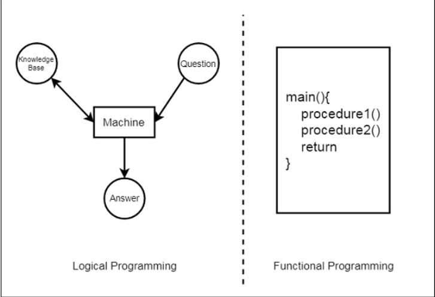

En esta imagen se puede ver la diferencia entre la programación funcional y la lógica. En la programación funcional, se definen procedimientos y funciones que se ejecutan en un orden determinado. En la programación lógica, se define una base de conocimiento y se hacen consultas sobre ella para obtener respuestas a preguntas.

## Instalación

La versión de Prolog que se utiliza en este tutorial es GNU Prolog. Se puede instalar desde el [sitio web oficial](http://www.gprolog.org/) para Windows, o en Linux con el administrador de paquetes de la distribución. En Ubuntu, se puede instalar con el siguiente comando:

```bash
sudo apt-get install gprolog
```

## Hola mundo

Para abrir Prolog, ejecutamos el comando `gprolog` en la terminal. Para imprimir "Hola, mundo!" se puede utilizar el siguiente código:

```prolog
write('Hola, mundo!').
```

> **Nota:** En Prolog, se debe terminar cada instrucción con un punto ( . ) para indicar el final de la instrucción.

La salida obtenida es la siguiente:

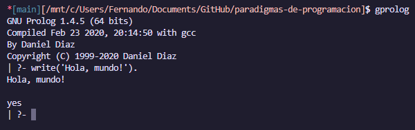

Si deseamos crear un archivo con código Prolog en vez de escribirlo en la consola, podemos crear un archivo con extensión `.pl` y ejecutarlo con el comando `gprolog < archivo.pl`. Opcionalmente también podemos cambiar de directorio desde el intérprete de Prolog con el comando `change_directory('ruta').` y cargar el archivo con extension `.pl` con el comando `[nombre].`.

**Código** `hello_world.pl`:

```prolog
main :- write('Hola Mundo!'),
write('Este programa está escrito en el archivo hello_world.pl').
```

**Salida:**

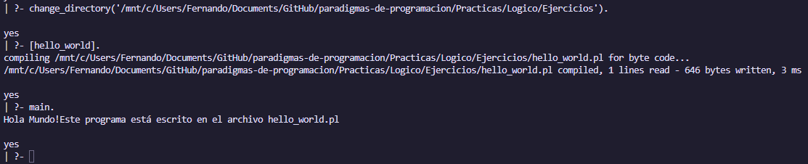

## Conceptos básicos

### Hechos

Usando hechos, podemos definir relaciones explicitas entre objetos y sus propiedades. Se puede decir que un hecho es una afirmación que siempre es verdadera. Algunos ejemplos de hechos son:

> -   Tom is a cat
> -   Kunal loves to eat Pasta
> -   Hair is black
> -   Nawaz loves to play games
> -   Pratyusha is lazy.

Estos hechos son incondicionalmente verdaderos. Para definir un hecho se deben seguir las siguientes reglas:

> -   Los nombres de las propiedades/comportamientos comienzan con letras minúsculas.
> -   El nombre de la relación aparece como el primer término.
> -   Los objetos aparecen como argumentos separados por comas dentro de paréntesis.
> -   Un punto "." debe terminar un hecho.
> -   Los objetos también comienzan con letras minúsculas. También pueden comenzar con dígitos (como 1234), y pueden ser cadenas de caracteres encerradas entre comillas, por ejemplo, color(pluma, 'rojo').
> -   phoneno(agnibha, 1122334455). también se llama predicado o cláusula.

#### Sintaxis

```prolog
relación(objeto1, objeto2, ..., objetoN).
```

#### Ejemplo

```prolog
cat(tom).
loves_to_eat(kunal,pasta).
of_color(hair,black).
loves_to_play_games(nawaz).
lazy(pratyusha).
```

### Reglas

Las reglas son afirmaciones acerca de objetos o relaciones entre objetos que son verdaderas si se cumplen ciertas condiciones. Las reglas se utilizan para definir relaciones entre objetos basadas en propiedades de esos objetos. Algunos ejemplos de reglas son:=

> -   Lili está feliz si baila.
> -   Tom tiene hambre si está buscando comida.
> -   Jack y Bili son amigos si ambos aman jugar al cricket.
> -   Ryan irá a jugar si la escuela está cerrada y está libre.

El símbolo `:-` se utiliza para definir una regla. La parte izquierda de la regla se llama cabeza y la parte derecha se llama cuerpo. La regla se lee como "Si el cuerpo es verdadero, entonces la cabeza también es verdadera".

#### Sintaxis

```prolog
nombre_de_la_regla(objeto1, objeto2, ...) :- hecho/regla(objeto1, objeto2, ...)

Suponga que tenemos un hecho como:
P :- Q;R.

También se puede escribir como:
P :- Q.
P :- R.

Si tenemos una clausula como:
P :- Q,R;S,T,U.

Se entiende como:
P :- (Q,R);(S,T,U).
Or can also be written as:
P :- Q,R.
P :- S,T,U.
```

#### Ejemplo

```prolog
happy(lili) :- dances(lili).
hungry(tom) :- search_for_food(tom).
friends(jack, bili) :- lovesCricket(jack), lovesCricket(bili).
goToPlay(ryan) :- isClosed(school), free(ryan).
```

### Consultas

Las consultas son preguntas acerca de objetos o relaciones entre objetos. Prolog intenta encontrar una respuesta a la consulta basándose en los hechos y reglas que se han definido. Algunos ejemplos de consultas son:

> -   ¿Tom es un gato?
> -   ¿A Kunal le gusta comer pasta?
> -   ¿Lili está feliz?
> -   ¿Saldrá a jugar Ryan?

### Bases de conocimiento

Una base de conocimiento es una colección de **hechos** y **reglas** que se utilizan para hacer consultas.

#### Ejemplo 1

```prolog
girl(priya).
girl(tiyasha).
girl(jaya).
can_cook(priya).
```

**Salida:**

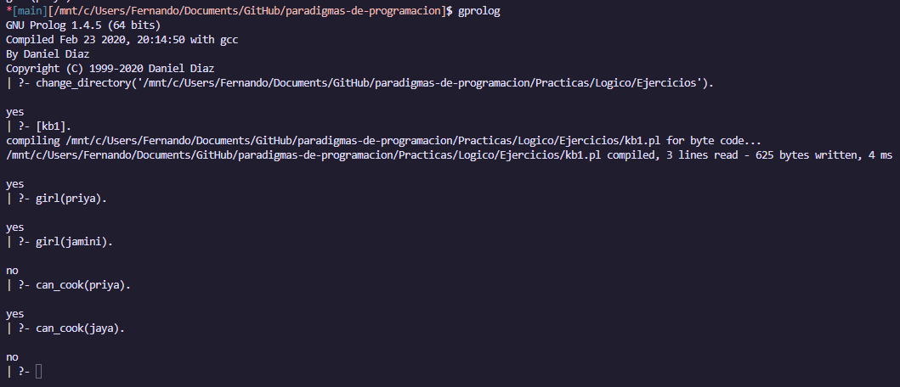

#### Ejemplo 2

```prolog
sing_a_song(ananya).
listens_to_music(rohit).

listens_to_music(ananya) :- sing_a_song(ananya).
happy(ananya) :- sing_a_song(ananya).
happy(rohit) :- listens_to_music(rohit).
playes_guitar(rohit) :- listens_to_music(rohit).
```

**Salida:**

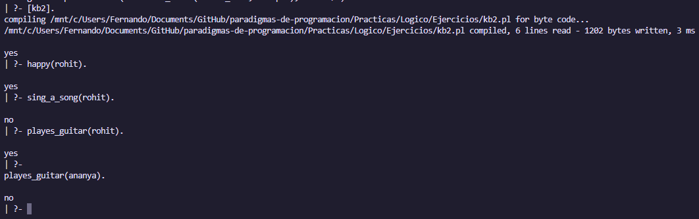

## Relaciones

Las relaciones son uno los conceptos más importantes en Prolog. Las relaciones definen cómo se relacionan los objetos entre sí. Las relaciones se pueden definir utilizando hechos y reglas.

En prolog, los programas especifican relaciones entre objetos y sus propiedades. Por ejemplo, si queremos definir una relación entre dos objetos, podemos hacerlo de la siguiente manera:

#### Ejemplo

Dos personas son hermanos si son hombres y tienen los mismos padres. Esto en prolog se puede definir de la siguiente manera:

```prolog
parent(sudip, piyus).
parent(sudip, raj).
male(piyus).
male(raj).
brother(X,Y) :- parent(Z,X), parent(Z,Y),male(X), male(Y).
```

Esta clausula nos dirá que piyus y raj son hermanos ya que ambos son hijos de sudip y ambos son hombres, sin embargo nuestra salida será: (piyus, piyus), (piyus, raj) y (raj, raj), es por eso que debemos agregar una condición para que X y Y no sean iguales, de esta forma el resultado sería `true`.

### Relaciones familiares

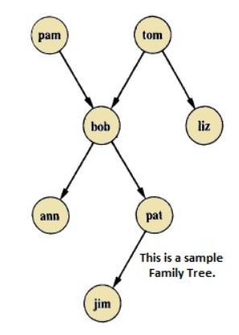

Con base a este diagrama de relaciones familiares podemos definir las siguientes relaciones:

bob es hijo de pam y de tom, bob tiene dos hijos (ann y pat). bob tiene un hermano llamado liz, del cual su padre también es tom. Con este conocimiento podemos definir las siguientes relaciones:

```prolog
parent(pam, bob).
parent(tom, bob).
parent(tom, liz).
parent(bob, ann).
parent(bob, pat).
parent(pat, jim).
parent(bob, peter).
parent(peter, jim).
```

Con estos predicados, pudimos definir las relaciones familiares de la familia de bob. Ahora podemos hacer consultas sobre estas relaciones.

Algunos hechos también se pueden escribir de la siguiente manera:

```prolog
female(pam).
male(tom).
male(bob).
female(liz).
female(pat).
female(ann).
male(jim).
```

O incluso asi:

```prolog
sex( pam, feminine).
sex( tom, masculine).
sex( bob, masculine).
... etc.
```

Para definir una relación entre madre y hermana, podemos hacerlo de la siguiente manera:

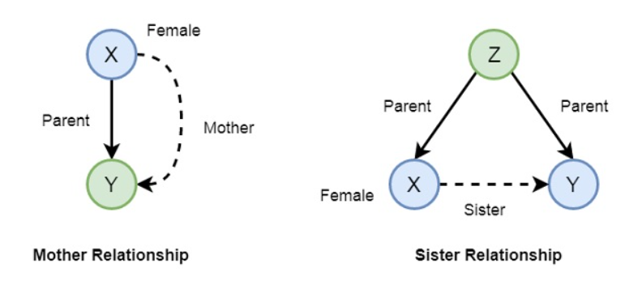

```prolog
mother(X,Y) :- parent(X,Y), female(X).

sister(X,Y) :- parent(Z,X), parent(Z,Y), female(X), X \== Y.
```

#### Base de conocimientos:

```prolog
female(pam).
female(liz).
female(pat).
female(ann).
male(jim).
male(bob).
male(tom).
male(peter).
parent(pam,bob).
parent(tom,bob).
parent(tom,liz).
parent(bob,ann).
parent(bob,pat).
parent(pat,jim).
parent(bob,peter).
parent(peter,jim).
mother(X,Y):- parent(X,Y),female(X).
father(X,Y):- parent(X,Y),male(X).
haschild(X):- parent(X,_).
sister(X,Y):- parent(Z,X),parent(Z,Y),female(X),X\==Y.
brother(X,Y):-parent(Z,X),parent(Z,Y),male(X),X\==Y.
```

**Salida:**


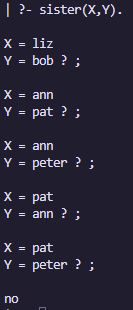

#### Ejemplo extendido

Se pueden establecer relaciones más complejas, como la relación de abuelo. Para definir la relación de abuelo, se puede hacer de la siguiente manera:

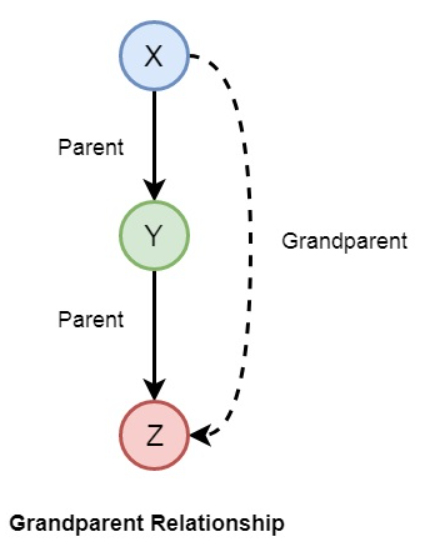

O incluso de esposa, tio, etc:

```prolog
grandparent(X,Y) :- parent(X,Z), parent(Z,Y).
grandmother(X,Z) :- mother(X,Y), parent(Y,Z).
grandfather(X,Z) :- father(X,Y), parent(Y,Z).
wife(X,Y) :- parent(X,Z),parent(Y,Z), female(X),male(Y).
uncle(X,Z) :- brother(X,Y), parent(Y,Z).
```

Ahora podemos hacer consultas sobre estas relaciones y trazar estas relaciones a la hora de ejecutar el programa.

****Salida:****

Tíos:

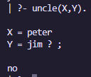

Abuelos:

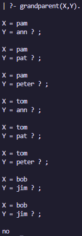

#### Trazar relaciones

Para entrar en el modo de traza, se puede utilizar el comando `trace.`. Este comando activa el modo de traza y muestra cómo se resuelven las consultas paso a paso.

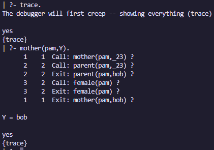

### Relaciones recursivas

Las relaciones recursivas son relaciones que se definen en términos de sí mismas. Por ejemplo, la relación de ancestro se puede definir de la siguiente manera:

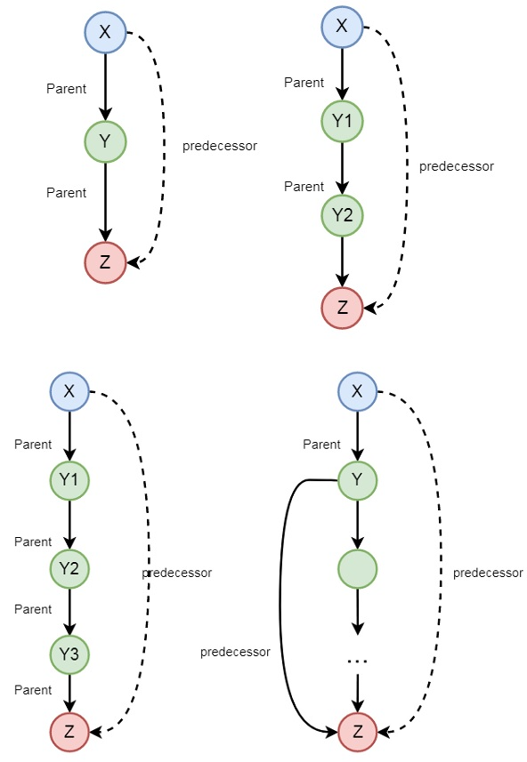

```prolog
predecessor(X, Z) :- parent(X, Z).
predecessor(X, Z) :- parent(X, Y),predecessor(Y, Z).
```

## Objetos de datos

Los objetos de datos se pueden dividir en varias categorías:

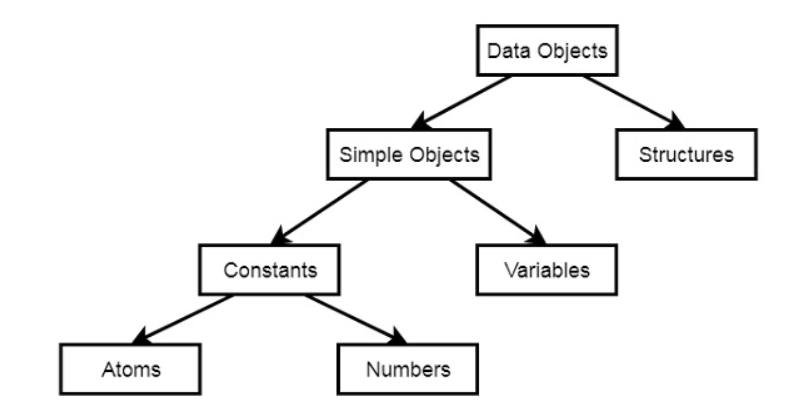

Ejemplos de objetos de datos son:

-   **Atoms** − tom, pat, x100, x_45
-   **Numbers** − 100, 1235, 2000.45
-   **Variables** − X, Y, Xval, \_X
-   **Structures** − day(9, jun, 2017), point(10, 25)

#### Átomos

Los átomos son una variación de las constantes. Pueden ser nombres u objetos. Para ser considerado un átomo debe ser una cadena de solo letras, dígitos o guiones bajos, comenzando con una letra en minúscula.

Otro uso de los átomos es para cadenas encerradas entre comillas simples. Por ejemplo, 'Hola, mundo!'.

#### Números

Otra variación de las constantes son los números. Los números en Prolog pueden ser enteros de -16383 a 16383.

Prolog también soporta números reales, pero su uso en Prolog es limitado, ya que es un lenguaje principalmente simbólico y no para cálculos numéricos. Dependiendo de la implementación de Prolog, puede variar el rango de los números reales.

#### Variables anónimas

Las variables anónimas son variables que se utilizan solo una vez. Se representan con un guion bajo ( _ ). Por ejemplo, `parent(X, _)` significa que no nos importa quién es el hijo.

Una implementación práctica sería la siguiente:

```prolog
hates(jim,tom).
hates(pat,bob).
hates(dog,fox).
hates(peter,tom).
```

Si queremos saber quién odia a tom, podemos hacer la siguiente consulta:

```prolog
?- hates(X,tom).
```

La salida será:

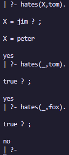

## Operadores

### Operadores comparativos

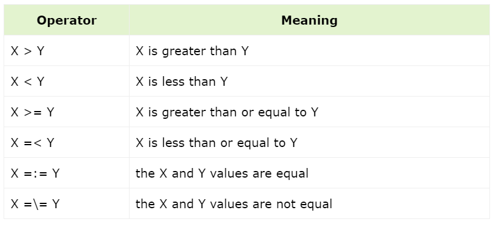

### Operadores aritméticos

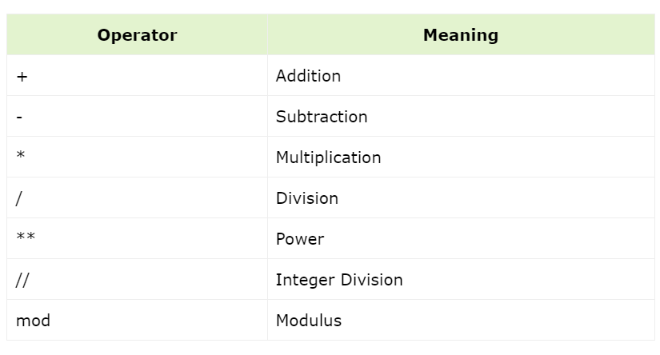

#### Ejemplo

```prolog
calc :- X is 100 + 200,write('100 + 200 is '),write(X),nl,
        Y is 400 - 150,write('400 - 150 is '),write(Y),nl,
        Z is 10 * 300,write('10 * 300 is '),write(Z),nl,
        A is 100 / 30,write('100 / 30 is '),write(A),nl,
        B is 100 // 30,write('100 // 30 is '),write(B),nl,
        C is 100 ** 2,write('100 ** 2 is '),write(C),nl,
        D is 100 mod 30,write('100 mod 30 is '),write(D),nl.
```

**Salida:**

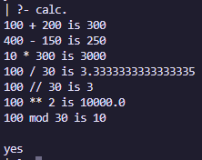

## Ciclos y toma de decisiones

### Ciclos

Los ciclos en Prolog no existen como tal, como en otros lenguajes de programación. En Prolog, se utilizan la recursividad y la toma de decisiones para lograr el mismo efecto que un ciclo.

#### Ejemplo

```prolog
count_to_10(10) :- write(10),nl.
count_to_10(X) :-
   write(X),nl,
   Y is X + 1,
   count_to_10(Y).
```

**Salida:**

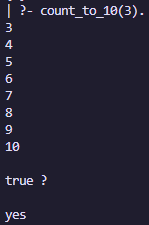

#### Ejemplo 2

```prolog
count_down(L, H) :-
   between(L, H, Y),
   Z is H - Y,
   write(Z), nl.

count_up(L, H) :-
   between(L, H, Y),
   Z is L + Y,
   write(Z), nl.
```

**Salida:**

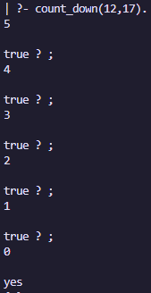

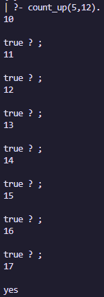

### Toma de decisiones

En Prolog, no tenemos una estructura de control de flujo como `if-else` o `if-elif-else`. En su lugar, se utilizan reglas y hechos para tomar decisiones.

#### Ejemplo

```prolog
% If-Then-Else statement

gt(X,Y) :- X >= Y,write('X is greater or equal').
gt(X,Y) :- X < Y,write('X is smaller').

% If-Elif-Else statement

gte(X,Y) :- X > Y,write('X is greater').
gte(X,Y) :- X =:= Y,write('X and Y are same').
gte(X,Y) :- X < Y,write('X is smaller').
```

**Salida:**

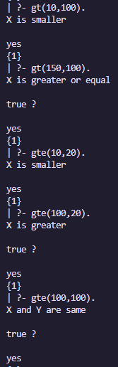

## Conjunciones y disyunciones

Las conjunciones y disyunciones son lo equivalente a los operadores lógicos `AND` y `OR` en otros lenguajes de programación.

### Conjunciones

Las conjunciones se utilizan para combinar dos o más condiciones. En Prolog, se utilizan comas ( , ) para representar una conjunción. Por ejemplo, si queremos saber si alguien es un padre y un hombre, podemos hacer la siguiente consulta: `father(john, bob)` lo que significa que john es el padre de bob, y `male(john)` lo que significa que john es un hombre. De esta forma, se puede decir que john es un padre **Y** un hombre.

### Disyunciones

Las disyunciones se utilizan para combinar dos o más condiciones. En Prolog, se utilizan puntos y comas ( ; ) para representar una disyunción. Por ejemplo, tenemos `father(john, bob)` lo que significa que john es el padre de bob y `mother(lili, bob)` lo que significa que lili es la madre de bob. Si queremos crear un predicado `child()` los podemos hacer si `father(john, bob)` **O** `mother(lili, bob)`.

#### Ejemplo

```prolog
parent(jhon,bob).
parent(lili,bob).

male(jhon).
female(lili).

% Conjunction Logic
father(X,Y) :- parent(X,Y),male(X).
mother(X,Y) :- parent(X,Y),female(X).

% Disjunction Logic
child_of(X,Y) :- father(X,Y);mother(X,Y).
```

**Salida:**

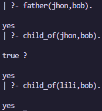

## Listas

Las listas son una colección de elementos. En Prolog, las listas se representan con corchetes ( [ ] ). Los elementos de una lista pueden ser cualquier tipo de datos, como átomos, números, variables, estructuras, etc.

### Representación de listas

En las listas de Prolog, el primer elemento de la lista se llama cabeza y el resto de la lista se llama cola. La cola de una lista es otra lista.

Supongamos que tenemos una lista como: `[rojo, verde, azul, blanco, oscuro].` Aquí la cabeza es roja y la cola es `[verde, azul, blanca, oscura].` Entonces la cola es otra lista.

Ahora, consideremos que tenemos una lista, `L = [a, b, c].` Si escribimos `Tail = [b, c].` entonces también podemos escribir la lista L como `L = [a | Tail].` Aquí la barra vertical (|) separa las partes de la cabeza y la cola.

### Operaciones con listas


### Operación de membresía

La operación de membresía se utiliza para verificar si un elemento está presente en una lista o no.

#### Ejemplo

```prolog
list_member(X,[X|_]).
list_member(X,[_|TAIL]) :- list_member(X,TAIL).
```

**Salida:**

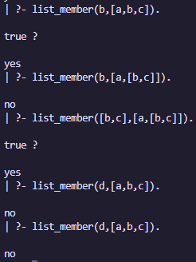

#### Calculo de longitud

```prolog
list_length([],0).
list_length([_|TAIL],N) :- list_length(TAIL,N1), N is N1 + 1.
```

#### Concatenación

```prolog
list_concat([],L,L).
list_concat([X1|L1],L2,[X1|L3]) :- list_concat(L1,L2,L3).
```

#### Eliminar de la lista

```prolog
list_delete(X, [X], []).
list_delete(X,[X|L1], L1).
list_delete(X, [Y|L2], [Y|L1]) :- list_delete(X,L2,L1).
```

#### Añadir a la lista

```prolog
list_member(X,[X|_]).
list_member(X,[_|TAIL]) :- list_member(X,TAIL).

list_append(A,T,T) :- list_member(A,T),!.
list_append(A,T,[A|T]).
```

#### Insertar a la lista

```prolog
list_delete(X, [X], []).
list_delete(X,[X|L1], L1).
list_delete(X, [Y|L2], [Y|L1]) :- list_delete(X,L2,L1).

list_insert(X,L,R) :- list_delete(X,R,L).
```

### Operaciones de reposicionamiento

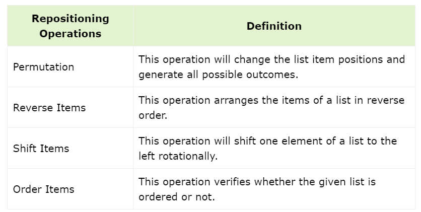

### Operaciones misceláneas

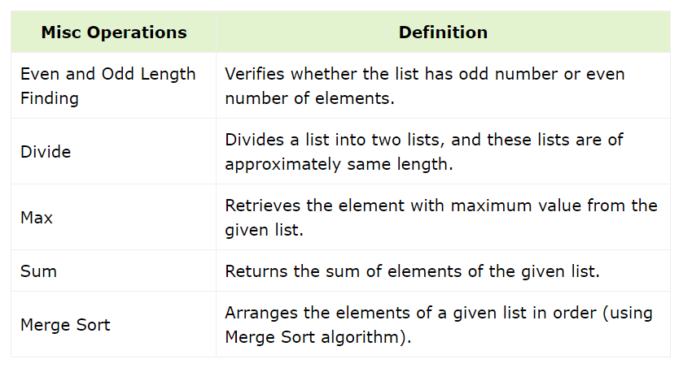

## Recursividad y estructuras

### Recursividad

La recursividad es un concepto importante en Prolog. En Prolog, la recursividad se utiliza para definir relaciones recursivas. Una relación recursiva es una relación que se define en términos de sí misma.

#### Ejemplo

```prolog
is_digesting(X,Y) :- just_ate(X,Y).
is_digesting(X,Y) :-just_ate(X,Z),is_digesting(Z,Y).
```

#### Ejemplo 2

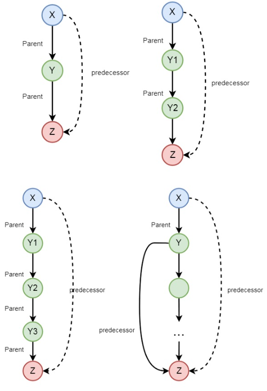

```prolog
predecessor(X, Z) :- parent(X, Z).
predecessor(X, Z) :- parent(X, Y),predecessor(Y, Z).
```

### Estructuras

Las estructuras y los objetos de datos son similares en Prolog. Las estructuras se utilizan para representar datos complejos. Las estructuras se definen con un nombre y una lista de argumentos. Ambos pueden tener múltiples componentes, y una estructura incluso puede contener otra estructura.

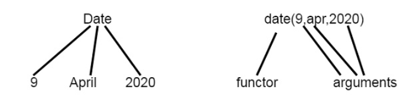

### Matching

El matching se utiliza para verificar si dos términos son iguales o no. En Prolog, el matching se realiza utilizando un operador de igualdad ( = ). Si los dos términos son iguales, entonces el matching es exitoso.

### Arboles binarios

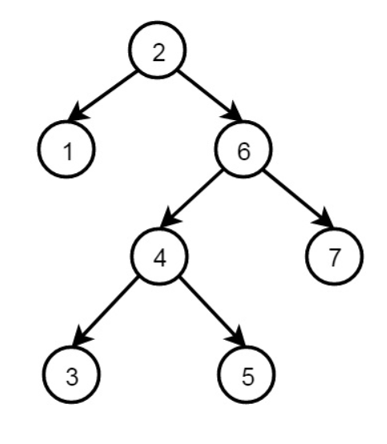

Los arboles binarios se pueden representar en Prolog de la siguiente manera utilizando estructuras recursivas:

```prolog
node(2, node(1,nil,nil), node(6, node(4,node(3,nil,nil), node(5,nil,nil)), node(7,nil,nil))
```

En esta definición, cada nodo tiene 3 campos: el dato y dos nodos.

## Backtracking

El backtracking es un proceso en el se busca el valor de verdad de diferentes predicados al verificar si son correctos o no. El término backtracking es bastante común en el diseño de algoritmos y en diferentes entornos de programación. En Prolog, hasta que alcanza el destino adecuado, intenta retroceder. Cuando se encuentra el destino, se detiene.

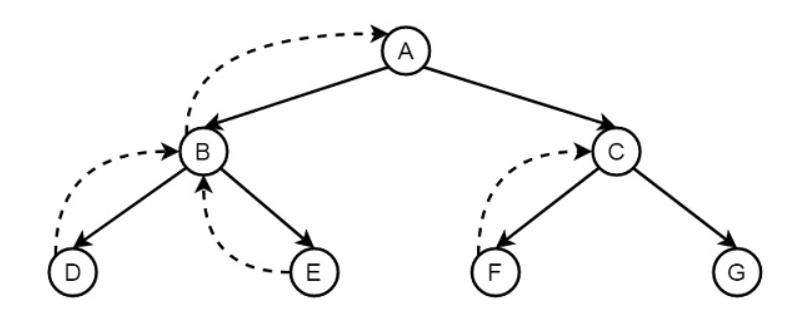

### ¿Como funciona?

#### Base de conocimientos

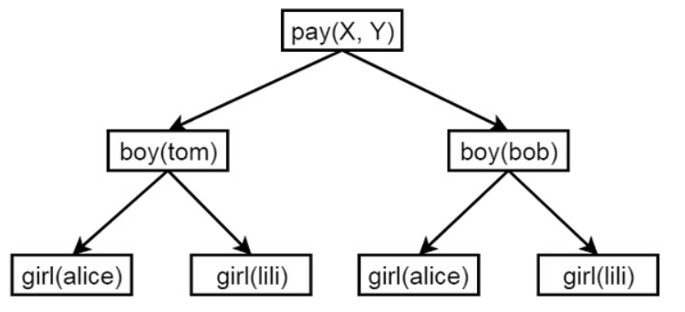

```prolog
boy(tom).
boy(bob).
girl(alice).
girl(lili).

pay(X,Y) :- boy(X), girl(Y).
```

**Salida:**

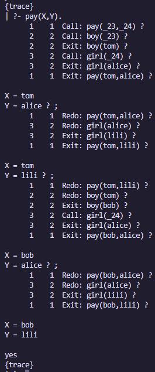

### Prevención de backtracking

El backtracking puede ser un proceso costoso en términos de rendimiento. Para evitarlo podemos utilizar el **Cut**. Suponga que tenemos las siguientes reglas:

#### Double step

> -   Rule 1 &minnus; if X < 3 then Y = 0
> -   Rule 2 &minnus; if 3 <= X and X < 6 then Y = 2
> -   Rule 3 &minnus; if 6 <= X then Y = 4

```prolog
f(X,0) :- X < 3. % Rule 1
f(X,2) :- 3 =< X, X < 6. % Rule 2
f(X,4) :- 6 =< X. % Rule 3
```

Ahora, si queremos evitar el backtracking, podemos hacerlo de la siguiente manera:

```prolog
f (X,0) :- X < 3, !. % Rule 1
f (X,2) :- 3 =< X, X < 6, !. % Rule 2
f (X,4) :- 6 =< X. % Rule 3
```

En el primer caso, si X es 2, entonces se probará la regla 1, luego la regla 2 y finalmente la regla 3. En el segundo caso, si X es 2, se probará la regla 1 y se detendrá.

Salida con backtracking:

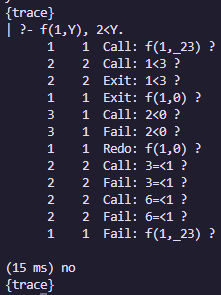

Salida sin backtracking:

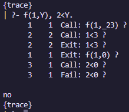

### Negación como falla

```
animal(dog).
animal(cat).
animal(elephant).
animal(tiger).
animal(cobra).
animal(python).

snake(cobra).
snake(python).

likes(mary, X) :- snake(X), !, fail.
likes(mary, X) :- animal(X).
```

**Salida:**

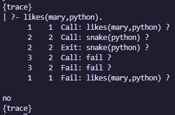

## Different y not

Los predicados `different` y `not` se utilizan para verificar si dos términos son iguales o no. Si los dos términos son iguales, entonces el predicado `different` falla. Si los dos términos son diferentes, entonces el predicado `different` es verdadero.

### Ejemplo different

```prolog
different(X, X) :- !, fail.
different(X, Y).
```

**Salida:**

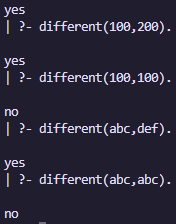

### Ejemplo not

```prolog
not(P) :- P, !, fail ; true.
```

**Salida:**

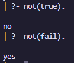

## Inputs y Outputs

### Write

El predicado `write` se utiliza para imprimir un mensaje en la consola.

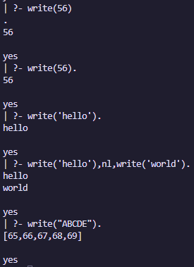

### Read

El predicado `read` se utiliza para leer un valor de la consola.

```prolog
cube :-
   write('Write a number: '),
   read(Number),
   process(Number).
process(stop) :- !.
process(Number) :-
   C is Number * Number * Number,
   write('Cube of '),write(Number),write(': '),write(C),nl, cube.
```

**Salida:**

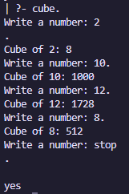

### Tab

El predicado `tab` se utiliza para insertar un número de espacios en la consola.

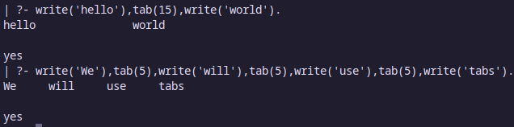

### Escritura y lectura de archivos

Para escribir en un archivo, se puede utilizar el predicado `tell` y `told`. `tell` toma el nombre del archivo como argumento y `told` se utiliza para cerrar el archivo.

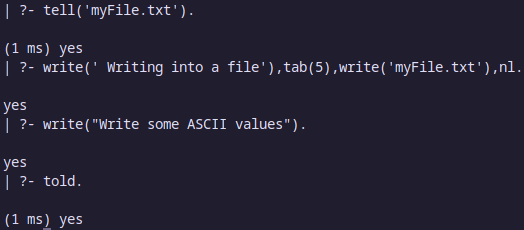

Para leer un archivo, se puede utilizar el predicado `see` y `seen`. `see` toma el nombre del archivo como argumento y `seen` se utiliza para cerrar el archivo.

Para procesar este archivo, escribimos este código:

```prolog
process_file :-
   read(Line),
   Line \== end_of_file, % when Line is not not end of file, call process.
   process(Line).
process_file :- !. % use cut to stop backtracking

process(Line):- %this will print the line into the console
   write(Line),nl,
   process_file.
```

**Salida:**

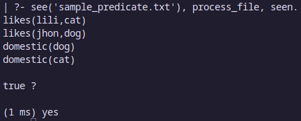

### Manipulación de caracteres

Para poder escribir y leer caracteres, se pueden utilizar los predicados `put` y `get`.

#### put(C) y put_char(C)

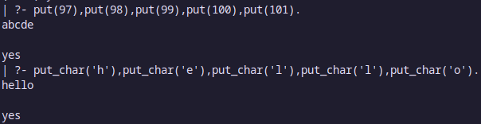

#### get_char(C) y get_code(C)

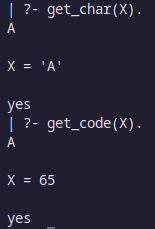

#### Construcción de átomos

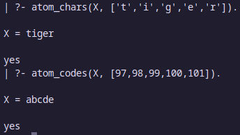

#### Descomposición de átomos

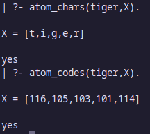

### Consult

Las técnica de consult se utiliza para combinar predicados de diferentes archivos. Para hacerlo, se puede utilizar el predicado `consult`. Suponga que queremos combinar los predicados de dos archivos, `prog_1.pl` y `prog_2.pl`. Podemos hacerlo de la siguiente manera:

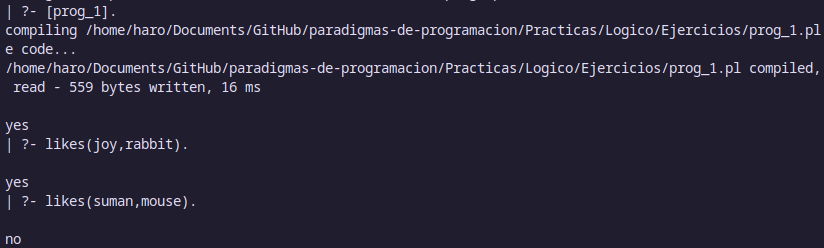

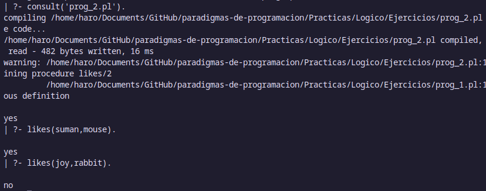

## Predicados integrados

### Predicados Comunes

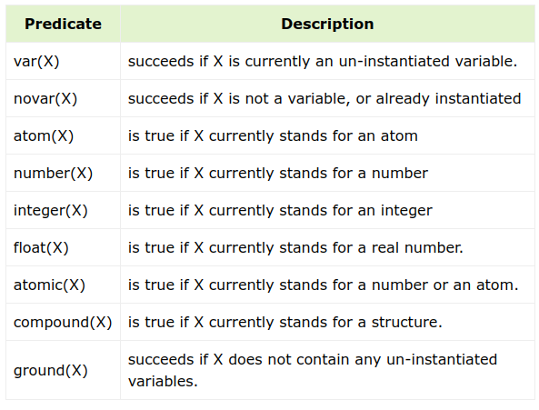

### Predicados Matemáticos

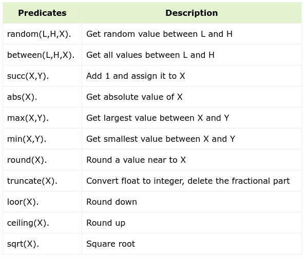

## Estructura de árbol


Para implementar esta estructura de árbol, se puede utilizar el siguiente código:

```prolog
/* The tree database */

:- op(500,xfx,'is_parent').

a is_parent b. c is_parent g. f is_parent l. j is_parent q.
a is_parent c. c is_parent h. f is_parent m. j is_parent r.
a is_parent d. c is_parent i. h is_parent n. j is_parent s.
b is_parent e. d is_parent j. i is_parent o. m is_parent t.
b is_parent f. e is_parent k. i is_parent p. n is_parent u.
n
is_parent v.
/* X and Y are siblings i.e. child from the same parent */

:- op(500,xfx,'is_sibling_of').

X is_sibling_of Y :- Z is_parent X,
                     Z is_parent Y,
                     X \== Y.
leaf_node(Node) :- \+ is_parent(Node,Child). % Node grounded

/* X and Y are on the same level in the tree. */

:-op(500,xfx,'is_at_same_level').
X is_at_same_level X .
X is_at_same_level Y :- W is_parent X,
                        Z is_parent Y,
                        W is_at_same_level Z.
```

**Salida:**


### Camino y localización

Añadimos una función para la ruta de un nodo a otro y para localizar un nodo en el árbol:

```prolog
path(a).                             /* Can start at a. */
path(Node) :- Mother is_parent Node, /* Choose parent, */
              path(Mother),          /* find path and then */
              write(Mother),
              write(' --> ').

/* Locate node by finding a path from root down to the node */
locate(Node) :- path(Node),
                write(Node),
                nl.
```


### Altura y valor máximo

Ahora, añadimos funciones para encontrar la altura de un nodo, el elemento máximo, y la altura del árbol:

```prolog
height(N,H) :- setof(Z,ht(N,Z),Set),
               max(Set,0,H).

ht(Node,0) :- leaf_node(Node),!.
ht(Node,H) :- Node is_parent Child,
              ht(Child,H1),
              H is H1 + 1.
max([],M,M).
max([X|R],M,A) :- (X > M -> max(R,X,A) ; max(R,M,A)).
```


## Referencias

-   [Prolog - Tutorialspoint](https://www.tutorialspoint.com/prolog/index.htm)
-   [Prolog - Wikipedia](https://en.wikipedia.org/wiki/Prolog)
-   [GNU Prolog](http://www.gprolog.org/)